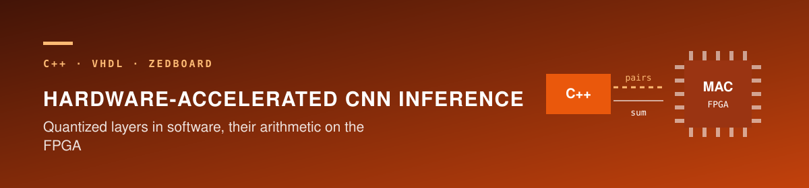
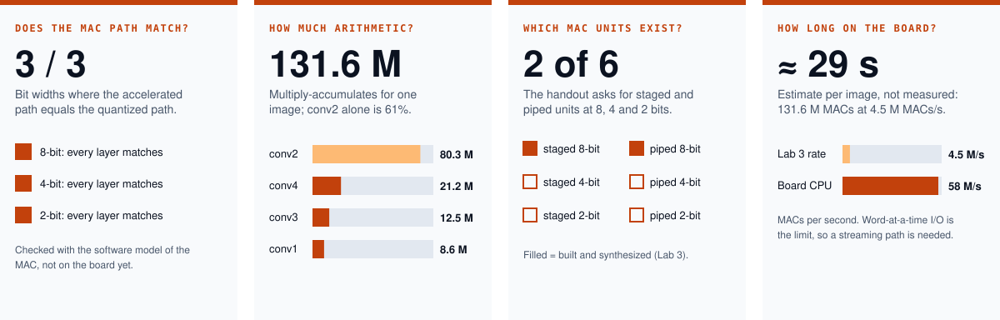
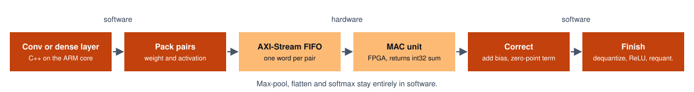

<div align="center">




Iowa State University · CprE 487/587 · Lab 5 · Team 06

[Overview](#overview) · [Results](#results) · [Variable MAC](#variable-precision-mac) · [Reproduce](#reproducing-the-board-builds) · [Submission](#submission)

</div>

---

> **Where it stands — implementation and submission package complete (checked October 9, 2026)**
> All six fixed-width MAC builds and the variable-precision MAC pass their board checks. Every inference layer matches the corresponding software-quantized result, the PPA comparison is recorded, and the Canvas-ready PDF and source archive are in `submission/`.



| | |
|---|---|
| Period | October 2026 — complete |
| Team | 06 — Zach Dixon and Jongwoo Kim |
| Stack | C++, VHDL, Vivado/Vitis 2020.1, ZedBoard (Zynq-7000) |
| Earlier labs | [Lab 4 — quantization](https://github.com/devjwk/cpre487lab4), [Lab 3 — MAC units](https://github.com/devjwk/cpre487lab3), [Lab 2 — C++ framework](https://github.com/devjwk/cpre487lab2) |

## Overview

Labs 1–4 produced a TinyImageNet CNN, a C++ inference framework, staged and pipelined MAC units, and 8/4/2-bit quantized models. Lab 5 integrates those pieces and evaluates the complete software–hardware path.

- Convolution and dense layers send signed weight and activation operands through an AXI-Stream FIFO to a hardware MAC.
- Max-pooling and flatten remain integer software operations; softmax remains floating point.
- The fixed-width study covers staged and pipelined MACs at 8, 4, and 2 bits.
- The variable design uses spatial accumulation and changes operand width at runtime without selecting between three independent multipliers.


## Accelerated layer



Lab 4 accumulates `(input − zero_point) × weight`, but that subtraction can exceed the signed operand range accepted by the MAC. The hardware therefore accumulates `input × weight`, while software folds `−zero_point × Σweights` into the per-output-channel offset.

## Results

### Fixed-width board runs

All six fixed-width systems process 131,595,776 MAC operations and report `ALL LAYERS MATCH` on the ZedBoard.

| MAC | Bits | LUT | FF | DSP | Standalone WNS | Board MAC time |
|---|---:|---:|---:|---:|---:|---:|
| Staged | 8 | 118 | 41 | 0 | +0.834 ns | 29.073 s |
| Staged | 4 | 76 | 41 | 0 | +1.100 ns | 29.080 s |
| Staged | 2 | 53 | 41 | 0 | +1.283 ns | 28.303 s |
| Pipelined | 8 | 41 | 138 | 1 | +0.511 ns | 29.074 s |
| Pipelined | 4 | 49 | 122 | 1 | +0.578 ns | 29.080 s |
| Pipelined | 2 | 56 | 114 | 1 | +0.721 ns | 28.303 s |

The nearly identical board times show that word-at-a-time ARM-to-FIFO transfers dominate the fixed-width executions. Changing the multiplier architecture or operand width alone does not remove that overhead.

### Variable-precision MAC

The selected layer widths are `8/4/8/4/4/4/4/8` for conv1 through dense2. The hardware reuses 2-bit multiplier bricks and combines their products through a registered adder tree.

| Check or metric | Result |
|---|---:|
| Exhaustive operand-pair self-tests | PASS at 8, 4, and 2 bits |
| Full inference | All 13 layers match |
| Standalone utilization | 842 LUT, 968 FF, 0 DSP |
| Standalone timing | +0.747 ns WNS at 200 MHz |
| Full-system timing | +2.367 ns WNS |
| FIFO data words | 38,244,352 — 29.1% of fixed-width traffic |
| Board MAC time | 11.546 s — 2.52× faster than staged 8-bit |
| Estimated full-system power | 1.690 W |
| Estimated full-system energy | 19.51 J for the measured MAC time |

Packing multiple operand pairs into each 32-bit FIFO word creates the speedup: two pairs at 8 bits, four at 4 bits, and eight at 2 bits. The remaining word-at-a-time writes still matter, so the variable path is 8.54× slower than its 1.352 s ARM-only software run.

### Same-calibration accuracy comparison

Images 800–999 select calibration ranges and images 0–799 form the evaluation set.

| Quantization | Top-1 | Top-10 |
|---|---:|---:|
| Uniform 8-bit | 24.125% | 60.500% |
| Uniform 4-bit | 21.625% | 59.750% |
| Uniform 2-bit | 3.375% | 17.250% |
| Mixed `8/4/8/4/4/4/4/8` | 24.000% | 60.625% |

The mixed model retains essentially the calibrated 8-bit accuracy while reducing FIFO traffic. Its accuracy should not be compared directly with the earlier Lab 4 numbers without accounting for their different calibration method.

## Progress against the handout

| Handout item | Status |
|---|---|
| 3.1–3.2 Accelerated inference type and layer implementations | Complete |
| 3.3 Six fixed-width MAC builds, reports, and XSA files | Complete |
| 3.4 Full inference matching software quantization | Complete on all six fixed systems |
| 4 Power, performance, area, and execution-time analysis | Complete in `util/lab5_06.ipynb` and the report |
| 5 Variable-precision design, layer selection, implementation, and comparison | Complete |
| 8 Report and source archive | Complete in `submission/` |
| 6 Shared demo spreadsheet | External course artifact; completion is not recorded in this repository |

## Reproducing the board builds

The complete Canvas source archive contains four configured software copies and every tested XSA. After extracting it and starting the data server, source Vitis 2020.1 and run the commands documented in the archive README.

```bash
source /remote/Xilinx/2020.1/Vitis/2020.1/settings64.sh
cd lab5_src_06/sw/variable_integrated_framework
./scripts/create_vitis -xsa_path ../../hw/variable_mac/variable_mac.xsa -workspace_dir workspace/variable
./scripts/flash_vitis -workspace_dir workspace/variable
```

Equivalent staged and pipelined commands for 8, 4, and 2 bits are listed in `lab5_src_06/README.md` inside the source ZIP.

## Submission

The `submission/` directory follows Section 8 of the handout:

- `lab5_report_06.pdf` — five-page lab report
- `lab5_src_06.zip` — executed notebook, helper scripts, four configured software frameworks, seven XSA files, hardware sources and reports, and recorded board logs

The archive passed `unzip -t`; the notebook contains 15 executed code cells. These files are prepared for Canvas, but this repository does not record whether they have been uploaded.

## Limitations

- Vivado power values are estimates rather than direct board power measurements.
- The PS7 accounts for most full-system power, so the measured runtime reduction drives the estimated energy improvement.
- CPU-driven memory-mapped FIFO writes remain the main performance limiter. A DMA or streaming producer would be the next architectural improvement.
- The handout asks groups to coordinate the variable-MAC method with a TA; that external discussion is not verifiable from repository artifacts.

## Repository layout

```text
hw/staged_mac, hw/piped_mac   Configurable fixed-width MAC IP, testbenches, scripts, and reports
hw/variable_mac              Spatial variable-precision MAC, testbench, scripts, and reports
hw/xsa                       Six fixed-width and one variable full-system XSA plus PPA reports
sw/framework                 Configurable C++ inference framework and Vitis automation
util                         Executed analysis notebook, helper scripts, and board logs
submission                   Canvas-ready report PDF and source ZIP
tools                        Reproducible notebook and report generators
```

## Team and resources

Lab 5 is the work of Team 06: Zach Dixon and Jongwoo Kim.

- Sze, Chen, Yang, and Emer, *Efficient Processing of Deep Neural Networks*, Chapter 7
- Course DNN framework template and `CprE487_587_Lab5.pdf`
- Xilinx Vivado and Vitis 2020.1 with the AXI4-Stream FIFO IP
